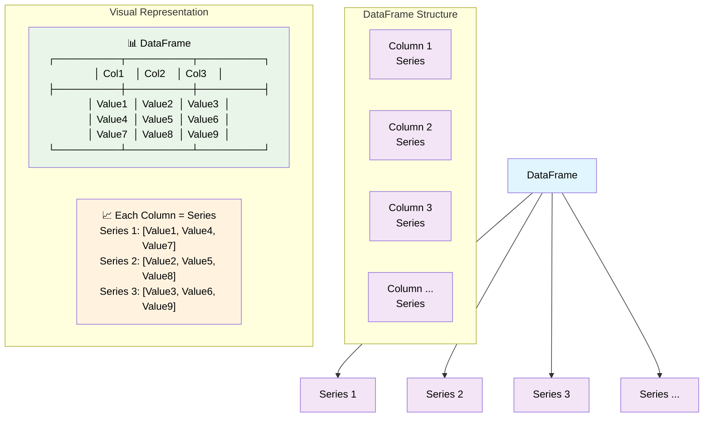
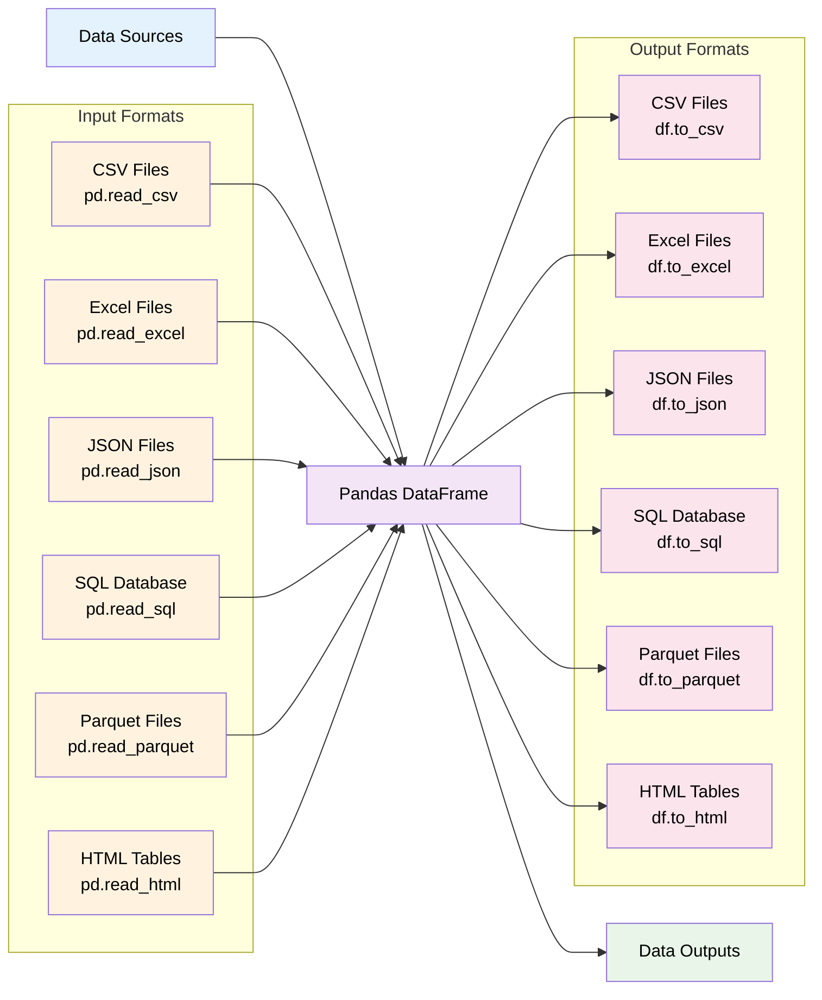

# pandas
# 🐼 Pandas Library - Comprehensive Guide

## Overview

Pandas is a powerful, open-source data analysis and manipulation library built on top of NumPy. It provides high-performance, easy-to-use data structures and data analysis tools for Python.

## Core Data Structures

### DataFrame and Series Relationship



## Data I/O Operations



## Data Manipulation Workflow

```mermaid
flowchart TD
    A[Raw Data] --> B[Load Data<br/>pd.read_*]
    B --> C[Explore Data<br/>df.info, df.describe]
    C --> D[Clean Data]
    D --> E[Transform Data]
    E --> F[Analyze Data]
    F --> G[Visualize Results]
    G --> H[Export Results]
    
    subgraph "Data Cleaning"
        D1[Handle Missing Values<br/>df.dropna, df.fillna]
        D2[Remove Duplicates<br/>df.drop_duplicates]
        D3[Data Type Conversion<br/>df.astype]
        D4[Outlier Detection<br/>df.quantile, df.describe]
    end
    
    subgraph "Data Transformation"
        E1[Filter Data<br/>df[condition]]
        E2[Group & Aggregate<br/>df.groupby]
        E3[Merge & Join<br/>pd.merge, df.join]
        E4[Pivot & Reshape<br/>df.pivot, df.melt]
        E5[Sort Data<br/>df.sort_values]
    end
    
    subgraph "Data Analysis"
        F1[Statistical Analysis<br/>df.mean, df.corr]
        F2[Time Series Analysis<br/>df.resample]
        F3[Text Analysis<br/>df.str methods]
        F4[Categorical Analysis<br/>df.cat methods]
    end 
    
    D --> D1
    D --> D2
    D --> D3
    D --> D4
    
    E --> E1
    E --> E2
    E --> E3
    E --> E4
    E --> E5
    
    F --> F1
    F --> F2
    F --> F3
    F --> F4
    
    style A fill:#ffebee,color:#000000
    style B fill:#e8f5e8,color:#000000
    style C fill:#e3f2fd,color:#000000
    style D fill:#fff3e0,color:#000000
    style E fill:#f3e5f5,color:#000000
    style F fill:#e1f5fe,color:#000000
    style G fill:#f9fbe7,color:#000000
    style H fill:#fce4ec,color:#000000
```

## GroupBy Operations

```mermaid
graph TD
    A[Original DataFrame] --> B[GroupBy Operation<br/>df.groupby]
    B --> C[Split Phase]
    C --> D[Apply Phase]
    D --> E[Combine Phase]
    E --> F[Result DataFrame]
    
    subgraph "Split"
        C1[Group 1]
        C2[Group 2]
        C3[Group 3]
        C4[Group N]
    end
    
    subgraph "Apply Functions"
        D1[Aggregation<br/>sum, mean, count]
        D2[Transformation<br/>standardize, normalize]
        D3[Filtration<br/>filter groups]
        D4[Custom Functions<br/>lambda, apply]
    end
    
    subgraph "Common Operations"
        G[df.groupby('column').sum()]
        H[df.groupby('column').mean()]
        I[df.groupby('column').count()]
        J[df.groupby('column').agg(func)]
        K[df.groupby('column').transform(func)]
    end
    
    C --> C1
    C --> C2
    C --> C3
    C --> C4
    
    D --> D1
    D --> D2
    D --> D3
    D --> D4
    
    B --> G
    B --> H
    B --> I
    B --> J
    B --> K
    
    style A fill:#e8f5e8,color:#000000
    style B fill:#f3e5f5,color:#000000
    style C fill:#fff3e0,color:#000000
    style D fill:#e3f2fd,color:#000000
    style E fill:#f9fbe7,color:#000000
    style F fill:#fce4ec,color:#000000
    style C1 fill:#ffebee,color:#000000
    style C2 fill:#ffebee,color:#000000
    style C3 fill:#ffebee,color:#000000
    style C4 fill:#ffebee,color:#000000
    style D1 fill:#e1f5fe,color:#000000
    style D2 fill:#e1f5fe,color:#000000
    style D3 fill:#e1f5fe,color:#000000
    style D4 fill:#e1f5fe,color:#000000
```

## Data Merging and Joining

```mermaid
graph TD
    A[DataFrame 1] --> C[Merge Operation]
    B[DataFrame 2] --> C
    C --> D[Merged DataFrame]
    
    subgraph "Join Types"
        E[Inner Join<br/>pd.merge(how='inner')]
        F[Left Join<br/>pd.merge(how='left')]
        G[Right Join<br/>pd.merge(how='right')]
        H[Outer Join<br/>pd.merge(how='outer')]
    end
    
    subgraph "Merge Methods"
        I[pd.merge(df1, df2)]
        J[df1.join(df2)]
        K[pd.concat([df1, df2])]
        L[df1.append(df2)]
    end
    
    subgraph "Join Keys"
        M[Single Key<br/>on='column']
        N[Multiple Keys<br/>on=['col1', 'col2']]
        O[Different Names<br/>left_on, right_on]
        P[Index Join<br/>left_index, right_index]
    end
    
    C --> E
    C --> F
    C --> G
    C --> H
    
    C --> I
    C --> J
    C --> K
    C --> L
    
    C --> M
    C --> N
    C --> O
    C --> P
    
    style A fill:#e8f5e8,color:#000000
    style B fill:#e8f5e8,color:#000000
    style C fill:#f3e5f5,color:#000000
    style D fill:#fff3e0,color:#000000
    style E fill:#e3f2fd,color:#000000
    style F fill:#e3f2fd,color:#000000
    style G fill:#e3f2fd,color:#000000
    style H fill:#e3f2fd,color:#000000
    style I fill:#f9fbe7,color:#000000
    style J fill:#f9fbe7,color:#000000
    style K fill:#f9fbe7,color:#000000
    style L fill:#f9fbe7,color:#000000
    style M fill:#fce4ec,color:#000000
    style N fill:#fce4ec,color:#000000
    style O fill:#fce4ec,color:#000000
    style P fill:#fce4ec,color:#000000
```

## Data Types and Memory Management

```mermaid
graph TD
    A[Pandas Data Types] --> B[Numeric Types]
    A --> C[Text Types]
    A --> D[DateTime Types]
    A --> E[Boolean Types]
    A --> F[Categorical Types]
    A --> G[Special Types]
    
    subgraph "Numeric"
        B1[int64, int32, int16, int8]
        B2[float64, float32]
        B3[uint64, uint32, uint16, uint8]
    end
    
    subgraph "Text"
        C1[object - default string]
        C2[string - dedicated string]
        C3[StringDtype - nullable string]
    end
    
    subgraph "DateTime"
        D1[datetime64[ns]]
        D2[timedelta64[ns]]
        D3[Period]
    end
    
    subgraph "Boolean"
        E1[bool - numpy boolean]
        E2[boolean - nullable boolean]
    end
    
    subgraph "Categorical"
        F1[category - memory efficient]
        F2[ordered categories]
        F3[unordered categories]
    end
    
    subgraph "Special"
        G1[nullable integers - Int64]
        G2[nullable floats - Float64]
        G3[sparse arrays]
        G4[interval data]
    end
    
    B --> B1
    B --> B2
    B --> B3
    
    C --> C1
    C --> C2
    C --> C3
    
    D --> D1
    D --> D2
    D --> D3
    
    E --> E1
    E --> E2
    
    F --> F1
    F --> F2
    F --> F3
    
    G --> G1
    G --> G2
    G --> G3
    G --> G4
    
    style A fill:#e8f5e8,color:#000000
    style B fill:#e3f2fd,color:#000000
    style C fill:#f3e5f5,color:#000000
    style D fill:#fff3e0,color:#000000
    style E fill:#f9fbe7,color:#000000
    style F fill:#fce4ec,color:#000000
    style G fill:#ffebee,color:#000000
```

## Performance Optimization

```mermaid
graph TD
    A[Performance Issues] --> B[Identify Bottlenecks]
    B --> C[Optimization Strategies]
    C --> D[Improved Performance]
    
    subgraph "Common Issues"
        A1[Large Dataset Loading]
        A2[Memory Usage]
        A3[Slow Operations]
        A4[Inefficient Loops]
    end
    
    subgraph "Optimization Techniques"
        C1[Chunking<br/>chunksize parameter]
        C2[Data Types<br/>optimize dtypes]
        C3[Vectorization<br/>avoid loops]
        C4[Indexing<br/>set_index, reset_index]
        C5[Caching<br/>store intermediate results]
        C6[Parallel Processing<br/>multiprocessing]
    end
    
    subgraph "Memory Management"
        D1[df.memory_usage()]
        D2[df.info(memory_usage='deep')]
        D3[pd.DataFrame.sparse]
        D4[del df, gc.collect()]
    end
    
    A --> A1
    A --> A2
    A --> A3
    A --> A4
    
    C --> C1
    C --> C2
    C --> C3
    C --> C4
    C --> C5
    C --> C6
    
    D --> D1
    D --> D2
    D --> D3
    D --> D4
    
    style A fill:#ffebee,color:#000000
    style B fill:#fff3e0,color:#000000
    style C fill:#e8f5e8,color:#000000
    style D fill:#e3f2fd,color:#000000
    style A1 fill:#fce4ec,color:#000000
    style A2 fill:#fce4ec,color:#000000
    style A3 fill:#fce4ec,color:#000000
    style A4 fill:#fce4ec,color:#000000
    style C1 fill:#f3e5f5,color:#000000
    style C2 fill:#f3e5f5,color:#000000
    style C3 fill:#f3e5f5,color:#000000
    style C4 fill:#f3e5f5,color:#000000
    style C5 fill:#f3e5f5,color:#000000
    style C6 fill:#f3e5f5,color:#000000
    style D1 fill:#f9fbe7,color:#000000
    style D2 fill:#f9fbe7,color:#000000
    style D3 fill:#f9fbe7,color:#000000
    style D4 fill:#f9fbe7,color:#000000
```

## Installation and Setup

```bash
# Install pandas
pip install pandas

# Install with additional dependencies
pip install pandas[all]

# Install specific version
pip install pandas==1.5.0

# Install from conda
conda install pandas
```

## Quick Start Example

```python
import pandas as pd
import numpy as np

# Create a DataFrame
df = pd.DataFrame({
    'Name': ['Alice', 'Bob', 'Charlie', 'Diana'],
    'Age': [25, 30, 35, 28],
    'City': ['New York', 'London', 'Tokyo', 'Paris'],
    'Salary': [50000, 60000, 70000, 55000]
})

# Basic operations
print(df.head())
print(df.info())
print(df.describe())

# Data manipulation
filtered_df = df[df['Age'] > 28]
grouped_df = df.groupby('City')['Salary'].mean()
```

## Key Features

- **Data Structures**: DataFrame and Series for handling structured data
- **Data I/O**: Read/write various formats (CSV, Excel, JSON, SQL, etc.)
- **Data Cleaning**: Handle missing values, duplicates, and data type conversions
- **Data Transformation**: Filter, group, merge, pivot, and reshape data
- **Statistical Analysis**: Descriptive statistics, correlation, and aggregation
- **Time Series**: Date/time functionality and time series analysis
- **Visualization**: Basic plotting capabilities with matplotlib integration
- **Performance**: Optimized operations built on NumPy and Cython

## Common Use Cases

- Data analysis and exploration
- Data cleaning and preprocessing
- ETL (Extract, Transform, Load) operations
- Statistical analysis and reporting
- Time series analysis
- Data visualization preparation
- Machine learning data preparation

## Resources

- [Official Documentation](https://pandas.pydata.org/docs/)
- [User Guide](https://pandas.pydata.org/docs/user_guide/)
- [API Reference](https://pandas.pydata.org/docs/reference/)
- [GitHub Repository](https://github.com/pandas-dev/pandas)
- [Community](https://pandas.pydata.org/community/)

## Contributing

Pandas is an open-source project and welcomes contributions from the community. See the [contributing guide](https://pandas.pydata.org/docs/development/contributing.html) for more information.

## License

Pandas is licensed under the BSD 3-Clause License.
