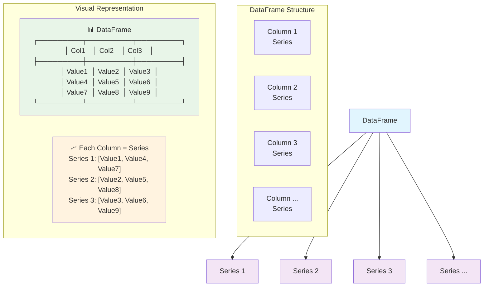

# pandas

```mermaid 
graph TD
    A[DataFrame] --> B[Series 1]
    A --> C[Series 2]
    A --> D[Series 3]
    A --> E[Series ...]
    
    subgraph "DataFrame Structure"
        F[Column 1<br/>Series] 
        G[Column 2<br/>Series]
        H[Column 3<br/>Series]
        I[Column ...<br/>Series]
    end
    
    subgraph "Visual Representation"
        J["📊 DataFrame<br/>┌─────────┬─────────┬─────────┐<br/>│ Col1    │ Col2    │ Col3    │<br/>├─────────┼─────────┼─────────┤<br/>│ Value1  │ Value2  │ Value3  │<br/>│ Value4  │ Value5  │ Value6  │<br/>│ Value7  │ Value8  │ Value9  │<br/>└─────────┴─────────┴─────────┘"]
        K["📈 Each Column = Series<br/>Series 1: [Value1, Value4, Value7]<br/>Series 2: [Value2, Value5, Value8]<br/>Series 3: [Value3, Value6, Value9]"]
    end
    
    style A fill:#e1f5fe
    style B fill:#f3e5f5
    style C fill:#f3e5f5
    style D fill:#f3e5f5
    style E fill:#f3e5f5
    style J fill:#e8f5e8
    style K fill:#fff3e0
```
